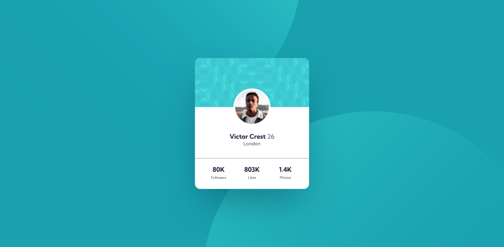

# Frontend Mentor - Profile card component solution

This is a solution to the [Profile card component challenge on Frontend Mentor](https://www.frontendmentor.io/challenges/profile-card-component-cfArpWshJ). Frontend Mentor challenges help you improve your coding skills by building realistic projects.

## Table of contents

- [Overview](#overview)
  - [The challenge](#the-challenge)
  - [Screenshot](#screenshot)
  - [Links](#links)
- [My process](#my-process)
  - [Built with](#built-with)
  - [What I learned](#what-i-learned)
  - [Continued development](#continued-development)
- [Author](#author)

## Overview

### The challenge

- Build out the project to the designs provided

### Screenshot

### Links

[Live Preview](https://profile-card-component-nw.netlify.app/)

## My process

### Built with

- Semantic HTML5 markup
- CSS custom properties
- Flexbox
- CSS Grid
- Mobile-first workflow

### What I learned

1. Sometimes close enough is good enough. It's important to find the right balance between quality and speed.
2. How to position elements so the overlap multiple elements (profile picture).
3. How to set multiple background images.

### Continued development

1. Writing semantic HTML
2. Positioning
3. Background images

## Author

- LinkedIn - [Nate Weber](https://www.linkedin.com/in/nweber3012/)
- Frontend Mentor - [@nweber3012](https://www.frontendmentor.io/profile/nweber3012)
