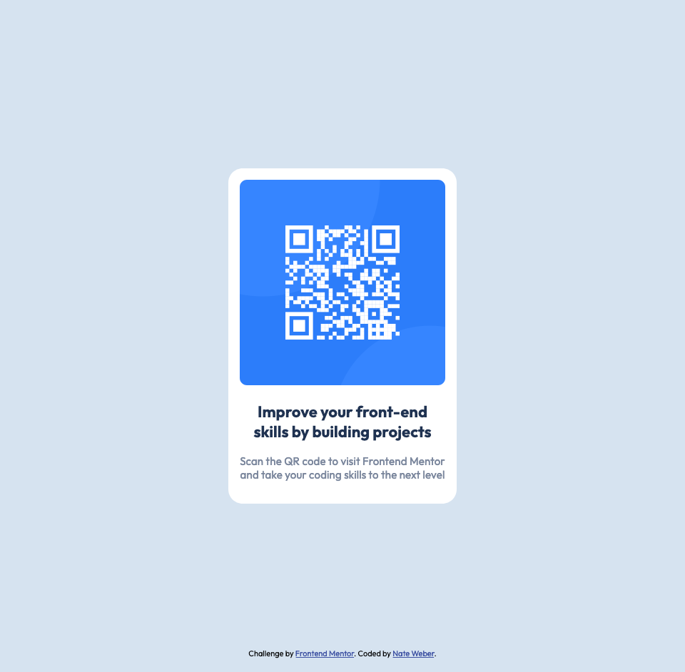

# Frontend Mentor - QR code component solution

This is a solution to the [QR code component challenge on Frontend Mentor](https://www.frontendmentor.io/challenges/qr-code-component-iux_sIO_H). Frontend Mentor challenges help you improve your coding skills by building realistic projects.

## Table of contents

- [Overview](#overview)
  - [Screenshot](#screenshot)
  - [Links](#links)
- [My process](#my-process)
  - [Built with](#built-with)
  - [What I learned](#what-i-learned)
  - [Continued development](#continued-development)
  - [Useful resources](#useful-resources)
- [Author](#author)

**Note: Delete this note and update the table of contents based on what sections you keep.**

## Overview

### Screenshot

### Links

- Solution URL: [Add solution URL here](https://your-solution-url.com)
- Live Site URL: [Add live site URL here](https://your-live-site-url.com)

## My process

### Built with

- Semantic HTML5 markup
- Flexbox
- Mobile-first workflow

### What I learned

While this was a relatively simple challenge, I did learn a few things. First, I learned where I can obtain styling information for elements in Figma.

### Continued development

There are two areas that I want to refine moving forward: Flexbox and positioning.

### Useful resources

- [A Complete Guide To Flexbox | CSS Tricks](https://css-tricks.com/snippets/css/a-guide-to-flexbox/#flexbox-properties) - I feel that this post does a very nice job of explaining Flexbox and what all of the properties do.

## Author

- LinkedIn - [Nate Weber](https://www.linkedin.com/in/nweber3012/)
- Frontend Mentor - [@nweber3012](https://www.frontendmentor.io/profile/nweber3012)
